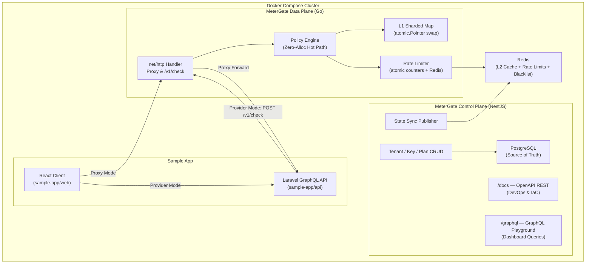

# MeterGate

MeterGate is a CV-grade, high-performance API metering and quota enforcement gateway. It demonstrates FAANG-level engineering standards by strictly separating management operations from the high-velocity data path.

## System Architecture



The architecture is split into two distinct planes:

1. **Control Plane (NestJS):**
- Exposes both OpenAPI REST (Swagger at `/docs`) and GraphQL (`/graphql`) sharing the exact same underlying services.
- Acts as the single source of truth for Tenant, Plan, and API Key metadata.
- **Leader-Elected Cache Syncing**: Periodically synchronizes authoritative database state to Redis L2 (`metergate:cache:*`). Uses a Redis Distributed Lock (`SET NX EX`) to ensure only one Control Plane node executes the heavy database sweep, preventing stampedes in horizontally scaled, multi-replica clusters.
2. **Data Plane (Go 1.22+):** A highly concurrent, zero-allocation reverse proxy that sits on the hot path. It validates API keys and enforces distributed rate limits at over 50,000 QPS using local L1 caches and a sharded Redis L2 topology.

### Synchronisation Contract (Control Plane → Data Plane)

| Data | Redis Key Pattern | Written By | Read By |
|---|---|---|---|
| API key validation cache | `apikey:{hash}` | Control Plane | Data Plane L2 lookup |
| Plan configuration (shard info) | `metergate:plan:{planCode}` | Control Plane | Data Plane (topology aware) |
| Dynamic blacklist | `metergate:blacklist:api-key-hashes` (SET) | Control Plane | Data Plane |
| Rate limit counters | `metergate:rate:{tenant}:{route}:{plan}:{window}` | Data Plane (Lua INCR) | Data Plane |

## Engineering Decisions & Trade-offs

### 1. Dual-Protocol Control Plane API

The NestJS Control Plane serves two distinct audiences using the exact same underlying service logic:

- **OpenAPI REST (`/docs`):** Optimised for DevOps, CI/CD automation, and Infrastructure-as-Code (Terraform/Pulumi). We intentionally avoided building a React "Admin Dashboard" because elite infrastructure products manage state via code, not clicks.
- **GraphQL (`/graphql`):** Optimised for the Traffic Simulator UI to prevent data over-fetching when querying nested Tenant and Plan data.

### 2. Plan-Based Key Salting

Each plan in `infra/metergate.yml` declares a `shardCount` property (e.g., `free: 1`, `starter: 3`). This enables the Data Plane to distribute high-velocity Enterprise traffic across multiple Redis salt buckets (`shard_0`..`shard_N`), preventing single-key hotspot contention on the Redis cluster.

### 3. Observability Philosophy

All structured logs are written exclusively to stdout in JSON format. There is no OpenTelemetry SDK, file-based logging, or external tracing infrastructure. This decision keeps the Control Plane dependency-free and aligns with twelve-factor app principles where log routing is the responsibility of the execution environment (Docker, Kubernetes).

### 4. Strict Configuration Validation

The system uses Zod schemas to validate `infra/metergate.yml` at boot time. If any required configuration (plan definitions, route tables, cache TTLs) is missing or malformed, the service immediately panics with a descriptive error rather than silently falling back to defaults.

### 5. Deterministic Development Environment (`mise`)

To guarantee environment reproducibility, we use `mise` to lock Node.js and Go compiler versions in `.mise.toml`. The `Makefile` dynamically injects `mise x --` into all build/test commands. This is a principal-level safeguard: it ensures developers inherently use the correct runtimes if `mise` is installed, while gracefully degrading to global tooling if it is not, avoiding hard vendor lock-in.

## Local Development

MeterGate uses `.mise.toml` to strictly lock development tooling versions. Ensure you have `mise` installed, then run `mise install` to provision Go 1.22+ and Node.js.

### Starting the Stack

```bash
# Boot PostgreSQL, Redis, and the Control Plane
docker compose -f infra/docker-compose.common.yml up -d

# Run database migrations
npx prisma migrate deploy

# Start the Control Plane in development mode
npm run start:dev
```

### Running Tests

```bash
# Unit tests (isolated, no infrastructure required)
npm run test

# E2E tests (requires PostgreSQL and Redis)
npm run test:e2e

# All tests via Makefile
make test
```

### API Documentation

- **Swagger UI:** [http://localhost:3000/docs](http://localhost:3000/docs)
- **OpenAPI JSON:** [http://localhost:3000/docs-json](http://localhost:3000/docs-json)
- **GraphQL Playground:** [http://localhost:3000/graphql](http://localhost:3000/graphql)
