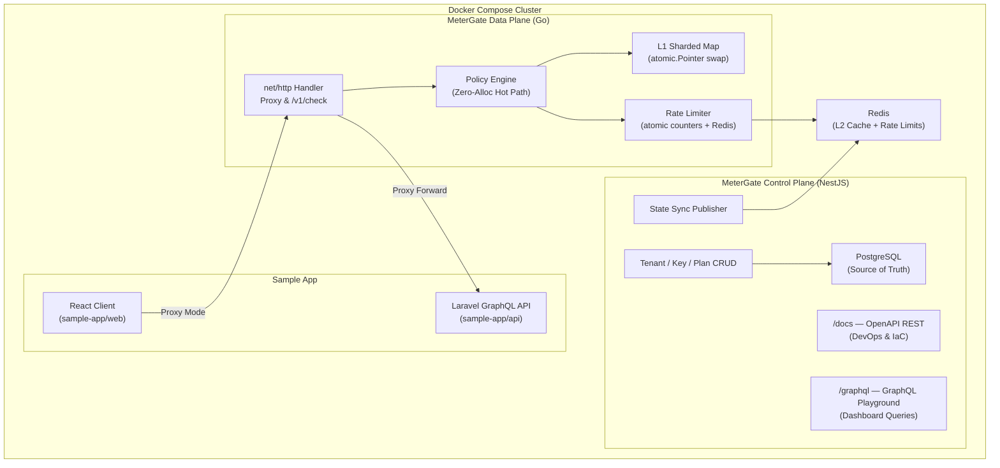

# MeterGate

MeterGate is a CV-grade, high-performance API metering and quota enforcement gateway. It demonstrates FAANG-level engineering standards by strictly separating management operations from the high-velocity data path.

## System Architecture



The architecture is split into two distinct planes:

1. **Control Plane (NestJS):**
- Exposes both OpenAPI REST (Swagger at `/docs`) and GraphQL (`/graphql`) sharing the exact same underlying services.
- Acts as the single source of truth for Tenant, Plan, and API Key metadata.
- **Leader-Elected Cache Syncing**: Asynchronously publishes authoritative cache states (Tenants/Keys) to the Redis L2 cluster. Uses a Redis Distributed Lock (`SET NX EX`) to ensure only one Control Plane node executes the heavy database sweep, preventing stampedes in horizontally scaled, multi-replica clusters.
2. **Data Plane (Go 1.22+):** A highly concurrent, zero-allocation reverse proxy that sits on the hot path. It validates API keys and enforces distributed rate limits at over 50,000 QPS using local L1 caches and a sharded Redis L2 topology.

### Synchronisation Contract (Control Plane → Data Plane)

| Data | Redis Key Pattern | Written By | Read By |
|---|---|---|---|
| API key validation cache | `apikey:{hash}` | Control Plane | Data Plane L2 lookup |
| Plan configuration (shard info) | `metergate:plan:{planCode}` | Control Plane | Data Plane (topology aware) |
| Rate limit counters | `metergate:rate:{tenant}:{route}:{plan}:{window}` | Data Plane (Lua INCR) | Data Plane |

## Engineering Decisions & Trade-offs

### 1. Dual-Protocol Control Plane API

The NestJS Control Plane serves two distinct audiences using the exact same underlying service logic:

- **OpenAPI REST (`/docs`):** Optimised for DevOps, CI/CD automation, and Infrastructure-as-Code (Terraform/Pulumi). We intentionally avoided building a React "Admin Dashboard" because elite infrastructure products manage state via code, not clicks.
- **GraphQL (`/graphql`):** Optimised for the Traffic Simulator UI to prevent data over-fetching when querying nested Tenant and Plan data.

### 2. Plan-Based Key Salting

Each plan in `infra/metergate.yml` declares a `shardCount` property (e.g., `free: 1`, `starter: 3`). This enables the Data Plane to distribute high-velocity Enterprise traffic across multiple Redis salt buckets (`shard_0`..`shard_N`), preventing single-key hotspot contention on the Redis cluster.

### 3. Observability Philosophy

All structured logs are written exclusively to stdout in JSON format. There is no OpenTelemetry SDK, file-based logging, or external tracing infrastructure. This decision keeps the Control Plane dependency-free and aligns with twelve-factor app principles where log routing is the responsibility of the execution environment (Docker, Kubernetes).

### 4. Strict Configuration Validation

The system uses Zod schemas to validate `infra/metergate.yml` at boot time. If any required configuration (plan definitions, route tables, cache TTLs) is missing or malformed, the service immediately panics with a descriptive error rather than silently falling back to defaults.

### 5. Deterministic Development Environment (`mise`)

To guarantee environment reproducibility, we use `mise` to lock Node.js and Go compiler versions in `.mise.toml`. The `Makefile` dynamically injects `mise x --` into all build/test commands. This is a principal-level safeguard: it ensures developers inherently use the correct runtimes if `mise` is installed, while gracefully degrading to global tooling if it is not, avoiding hard vendor lock-in.

### 6. Two-Tier Quota Aggregation

To avoid blocking the Go Data Plane hot-path on Redis roundtrips for global rate limit sums, we implemented a Two-Tier system:
1. **Tier 1 (Fast-Path)**: The Data Plane evaluates limits purely against an extremely fast, zero-allocation local L1 cache (`sync.Map`), ensuring latency stays in the sub-millisecond range. It also fires non-blocking `INCR` commands via connection pools.
2. **Tier 2 (Background Sync)**: An asynchronous background goroutine periodically (`100ms`) aggregates the global sum of all traffic across the salt buckets (`shard_0`..`shard_N`) using Redis `MGET`, and updates the L1 cache.


## Data Plane Design Principles

### 7. Quorum Write Fencing

The production topology utilizes a Native 3-Shard Redis Cluster (1M + 2R = 9 nodes). To eliminate the possibility of split-brain during a network partition (where the Data Plane might artificially reset rate limit quotas if a Master disconnects from its Replicas), we strictly enforce Quorum Write Fencing using `min-replicas-to-write: 1` and `min-replicas-max-lag: 5` on the Redis infrastructure layer.

### 8. Crash-Only / Fail-Fast Data Plane Boot
The Go Data Plane follows a strict Fail-Fast philosophy. On startup, it actively attempts to resolve the Redis cluster topology. If the cluster is unreachable or misconfigured, the process panics and exits immediately. This allows Docker Compose or Kubernetes Liveness Probes to cleanly isolate or restart the nodes without silently dropping traffic or returning ambiguous 5xx errors.

### 9. Organic Chaos Engineering (GC Tuning)
To mathematically prove the value of our Zero-Allocation hot path, the Data Plane includes a chaos engineering flag: `DISABLE_ZERO_ALLOC=true`. Rather than synthetically inflating memory with fake byte arrays, this flag organically strips away `sync.Pool` buffer pooling from the underlying `httputil.ReverseProxy`. This forces the Go standard library to naturally allocate and garbage-collect `io.Copy` buffers on the heap for every single proxy request, authentically simulating the performance degradation experienced by legacy proxy architectures.

### 9. Binary Blackbox Integration Testing
Integration tests in the Go Data Plane do not rely on mock HTTP handlers. We strictly utilize a Binary Blackbox approach: the `go test` suite actively compiles the Data Plane to an executable binary, boots a mock HTTP upstream, seeds a live Redis container, and runs the binary via `os/exec`. This guarantees 100% production parity for boundary tests, allowing us to verify the Proxy Mode (`/*`) under identical constraints.

## Local Development

MeterGate uses `.mise.toml` to strictly lock development tooling versions. Ensure you have `mise` installed, then run `mise install` to provision Go 1.22+ and Node.js.

### Starting the Stack

```bash
# Boot the entire infrastructure stack in Docker (Databases, Control Plane, Data Plane)
make infra-up

# Force a rebuild of the Docker images before booting (if dependencies changed)
make infra-up BUILD=1

# Native Development Workflow (Fastest iteration speed)
# Boots only Redis & Postgres in Docker, and runs the Go and NestJS services natively
make dev

# If you have zombie processes holding ports 3000 or 8080, you can forcefully kill them:
make dev OVERRIDE=1
```

### Running Tests

```bash
# Execute unit, integration, and blackbox smoke tests across both planes
make test
```

### API Documentation

- **Swagger UI:** [http://localhost:3000/docs](http://localhost:3000/docs)
  *(Note: You can use the Swagger UI to interactively test the system by dynamically provisioning new Tenants and API Keys).*
- **OpenAPI JSON:** [http://localhost:3000/docs-json](http://localhost:3000/docs-json)
- **GraphQL Playground:** [http://localhost:3000/graphql](http://localhost:3000/graphql)

