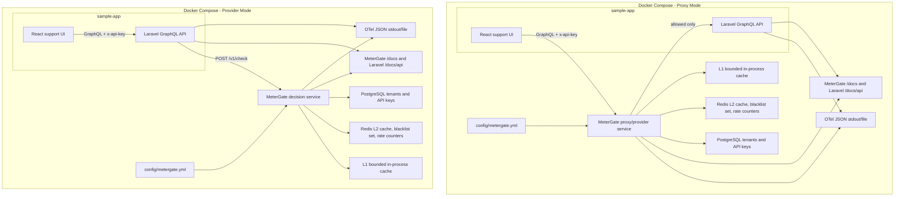

# System Design



## Overview

MeterGate is a compact API usage metering and quota enforcement engine. It demonstrates multi-tenant API-key validation, config-driven protected routes and plans, Redis-backed distributed rate limiting, PostgreSQL-backed durable key state, generated API docs, OpenTelemetry-style JSON output, and a two-mode sample app.

It is billing-ready infrastructure, not a billing platform. There are no invoices, payments, identity flows, Kafka, Kubernetes, service mesh, or observability stack.

## Problem Statement

Small API products often need usage enforcement before they are ready for full billing. MeterGate answers one narrow question on the request path: should this tenant key be allowed to make this request right now?

## Architecture Summary

The root NestJS service loads `config/metergate.yml`, matches protected routes by method and path prefix, hashes API keys, checks static and Redis blacklists, resolves tenant plan state from PostgreSQL, and applies Redis fixed-window rate limits with a Lua script.

Proxy mode and provider mode reuse the same `PolicyEngineService`. The only difference is who consumes the `PolicyDecision`: the MeterGate proxy controller or Laravel provider-mode middleware.

The shared policy path is:

1. Match method and path-prefix against `config/metergate.yml`.
2. Require an API key only for protected routes.
3. Hash the key with `METERGATE_KEY_HASH_SECRET`.
4. Check config static blacklist and Redis dynamic blacklist before database work.
5. Resolve API-key and tenant plan from PostgreSQL, with short L1 and Redis cache TTLs.
6. Apply a Redis Lua fixed-window counter shared by all MeterGate replicas.
7. Return a `PolicyDecision` consumed by either the proxy controller or Laravel provider middleware.

The React sample talks to MeterGate in proxy mode and to Laravel in provider mode. Laravel only calls MeterGate when `METERGATE_MODE=provider`.

## Mode Comparison

| Mode | Client calls | MeterGate role | Laravel role |
| --- | --- | --- | --- |
| Proxy | MeterGate | In-path proxy and enforcer | Receives only allowed requests |
| Provider | Laravel | Decision service at `POST /v1/check` | Calls MeterGate and blocks denied requests |

## Request Flows

Proxy mode:

1. React sends GraphQL traffic to `http://localhost:3000/graphql`.
2. MeterGate evaluates the API key, blacklist state, plan, and Redis quota.
3. Allowed requests are forwarded to Laravel.
4. Denied requests return `401`, `403`, or `429` and never reach Laravel.

Provider mode:

1. React sends GraphQL traffic to `http://localhost:8000/graphql`.
2. Laravel calls `POST http://metergate:3000/v1/check`.
3. Laravel continues only when MeterGate returns `allowed: true`.

## Caching

L1 cache is bounded with short TTLs for route matches, API-key lookups, tenant plan lookups, static blacklist material, Redis blacklist membership, and sanitized config.

Redis is the L2 layer for shared quota counters, dynamic blacklist membership, and optional API-key/plan cache records. PostgreSQL remains source of truth for tenants, API keys, revocation, and plan assignment.

## Rate Limiting

Rate limits are configured per plan group in `config/metergate.yml`. The demo free plan allows six GraphQL requests per minute so the React fake request generator can hit `429` quickly.

Redis uses one Lua script to increment the counter, set TTL on first use, and return remaining/reset metadata atomically. Counter keys do not include replica identity, so scaled MeterGate containers share the same limits.

## Blacklist Behavior

Static API-key hashes live in `config/metergate.yml`. Dynamic blacklist hashes live in the Redis set `metergate:blacklist:api-key-hashes`.

Blacklist checks happen before database lookup and rate limiting.

## Config File

`config/metergate.yml` defines:

- server port and API-key header;
- proxy upstream URL and timeout;
- protected routes;
- plan groups, limits, and `second|minute|hour` units;
- L1/L2 TTLs;
- static blacklist hashes.

## Docker Compose

Proxy mode:

```bash
docker compose -f docker-compose.common.yml -f docker-compose.proxy.yml up --build
```

Provider mode:

```bash
docker compose -f docker-compose.common.yml -f docker-compose.provider.yml up --build
```

Seed MeterGate state:

```bash
docker compose -f docker-compose.common.yml -f docker-compose.proxy.yml exec metergate npm run prisma:migrate
docker compose -f docker-compose.common.yml -f docker-compose.proxy.yml exec metergate npm run prisma:seed
```

Scale MeterGate:

```bash
docker compose -f docker-compose.common.yml -f docker-compose.provider.yml up --scale metergate=2
```

## API Docs

MeterGate:

- `http://localhost:3000/docs`
- `http://localhost:3000/docs-json`

Laravel sample API:

- `http://localhost:8000/docs/api`
- `http://localhost:8000/docs/api.json`

GraphQL endpoint:

- `POST /graphql`

## Tests

Root NestJS:

```bash
npm run typecheck
npm run lint
npm run test
```

Laravel:

```bash
cd sample-app/api
composer test
```

React:

```bash
cd sample-app/web
npm run build
```

Smoke tests:

```bash
npm run smoke:proxy
npm run smoke:provider
```

## Known Tradeoffs

- Fixed-window rate limiting is simple and predictable; a sliding window is left as a credible future improvement.
- Redis Pub/Sub invalidation is not implemented; short TTLs keep demo behavior fresh enough.
- API-key lifecycle is seeded, not managed by an admin UI.
- OpenTelemetry is emitted as structured JSON to stdout/file instead of using a collector.

## Excluded Features

No payments, invoices, OAuth, customer dashboard, long-term request warehouse, Kafka, Kubernetes, service mesh, Prometheus, Grafana, Jaeger, Loki, or OTel Collector deployment.

## Technologies Used

NestJS, TypeScript, Prisma, PostgreSQL, Redis, Laravel, Lighthouse GraphQL, Scramble, React, Vite, Docker Compose, Jest, PHPUnit, OpenAPI, and JSON log/trace output.

## CV Bullets

- Built a mode-neutral policy engine used by both reverse proxy and provider decision-service workflows.
- Implemented Redis-backed distributed fixed-window rate limiting with atomic Lua execution.
- Designed L1/L2 cache behavior for request-path API-key validation and blacklist checks.
- Documented and orchestrated a multi-service local demo with generated API docs and smoke tests.
